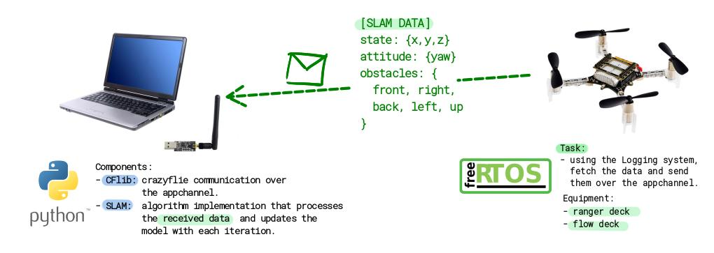

# crazyflie_slam
**crazyflie_slam** implements a real-time SLAM algorithm for the Crazyflie nanodrone that relies on the FlowDeck for the state estimate and on the RangerDeck for obstacle information.

## SLAM
SLAM, which stands for Simultaneous Localization and Mapping, refers to a set of algorithms used in robotics and computer vision that enable a device (such as a robot or drone) to create a map of an unknown environment while simultaneously keeping track of its own location within that environment.

For the Crazyflie there were two main questions to answere before starting.
1. What type of sensors, i.e. shall we use the **AI deck** with the camera or **RangerDeck** with 4 Time-of-Flight sensors?
2. Where will the SLAM computations take place? Should we rely solely on the **on-board** processing power, or should we also utilize an external processor, such as a personal computer, for **offloading** tasks?
 
There are two independent choices, resulting in four possible configurations:
- AI deck with on-board processing
- AI deck with off-board processing
- RangerDeck with on-board processing
- RangerDeck with off-board processing :white_check_mark:

We have opted for the last configuration.

We searched for some algorithms that do implement the SLAM task using the available data, i.e. state estimate and four distances.

The main resource used is https://github.com/khazit/CrazySLAM

The structure of our code is the described in the following image.



As we can see we have a FreeRTOS task added in the Crazyflie firmware that iteratively collect the useful data and then send it over the appchannel to the corresponding endpoint that uses Python-CFlib to read the packet. Furthermore we have the SLAM algorithm that continuously comsumes the received data and updates the model.

## Repository structure
- ```async/```: it contains the code for separating the data *collection* (csv file) and the data *consumption* for the SLAM algorithm
- ```crazyslam/```: it contains the SLAM algorithm implementation
  - ```mapping.py```: 2d occupancy grid map using ToF sensors range inputs
  - ```localization.py```: state estimate of the Crazyflie using a particle filter
  - ```slam.py```: SLAM algorithm that combines mapping and localization
- ```imgs```
- ```my_app_slam.c```: FreeRTOS task for collecting and sending data over the appchannel
- ```README.md```: recursive :P
- ```real_time_slam.py```: **real-time version of the SLAM algorithm**, the CFlib "packet_received" callback adds data in a queue and the Main Thread consumes them and run the SLAM algorithm.
- ```requirements.txt```: required python packages


## Installation
- Download repository with ```git clone https://github.com/JustFanta01/crazyflie_slam.git```
- 
- Crazyflie FreeRTOS task:
  - Download the crazyflie firmware
    - ```git clone --recursive https://github.com/bitcraze/crazyflie-firmware.git```
  - Create a new app
    - if present, clean the folder ```examples/app_hello_world/build``` and duplicate the folder ```examples/app_hello_world``` and rename it as ```examples/app_slam```
    - Copy the ```my_app_slam.c``` in the folder ```examples/app_slam/src/```
    - Modify the ```app_slam/src/Kbuild``` with ```obj-y += my_app_slam.o```
    - in the ```examples/app_slam``` folder run ```make menuconfig```
      - App Layer Configuration --> Enable app entry point --> Save & Exit 
  - Cross-compile the firmware with ```make -j$(nproc)``` inside the the ```examples/app_slam``` folder.
  - Flash the new firmware over the Crazyflie Radio with ```cfloader flash build/cf2.bin stm32-fw -w <radio address>``` for example ```-w "radio://0/80/2M/E7E7E7E7E7"```

- Python CFlib
  - Create virtual environment and activate it
    - ```python –m venv cps```
    - ```source cps/bin/activate```
  - Install the required python packages with ```pip install -r requirements.txt```
  - Configure correctly the radio address

- Run SLAM algorithm
  - for the real time SLAM run: ```python real_time_slam.py```
  - for the async version (CSV file):
    - enter the ```async``` folder
    - to create a new csv file logging in real-time the crazyflie data use: ```python slam_logging_appchannel.py```
      - otherwise, check the ```async/datasets``` for examples.
    - to run asynchronously the SLAM algorithm: ```python sim_slam_csv.py```